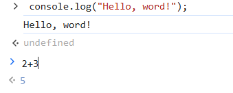
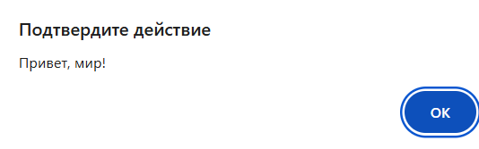
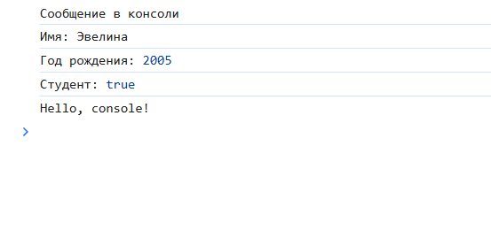
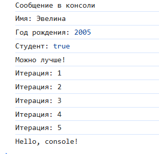

# Evelina-Gorbatiuc
# Отчет по первой лабораторной 
Государственный университет Молдовы 

 Факультет Математики и Информатики 
  
 Департамент Информатики 

                            ЛАБОРАТОРНАЯ РАБОТА №1

                             Введение в  JavaScript 
Подготовила студентка группы IA2403: 

 Горбатюк Эвелина

 2025 Кишинэу

 
## Теоретическая часть
Формулировка задачи

В этой работе я разберусь, как запустить JavaScript в браузере, создам простую 
веб-страницу, подключу внешний скрипт и научусь  работать с переменными, 
условиями и циклами.

Цели:

Разобраться, как работает JavaScript в браузере. 
Научиться подключать и выполнять код в HTML. 
Освоить основы: переменные, условия, циклы. 
Понять, как выводить данные в консоль и на страницу.

Этапы работы: 

1. Запуск JavaScript в браузере – выполняем код в консоли DevTools. 
2. Создание HTML-страницы – добавляем встроенный скрипт. 
3. Подключение внешнего файла – пишем код в script.js и связываем с 
HTML. 
4. Работа с переменными – объявляем и выводим их в консоль. 
5. Использование условий и циклов – пишем проверки и повторяющиеся 
действия. 
6. Проверка работы – открываем страницу, смотрим в консоль и на 
всплывающие сообщения.

## Практическая часть 

                    Задание 1. Выполнение кода в браузере 

Выполнение кода JavaScript в браузере 

Создан первый HTML-страницы с JavaScript и списан код,который указан в 
задании лабораторной. Код выполняется в браузере следующим образом:

Создан файл script.js и списан туда код,после соединила файл index.html с этим 

                     Задание 2. Работа с типами данных 

В файле script.j создала несколько переменных : name,birthYear,isStudent и вывела их в консоль. 

Добавив следующий код в script.js, я выполняю управление потоком 
выполнения (условия и циклы) 

 ## Контрольные вопросы

      1. Чем отличается var от let и const? 

var — Где используется: Объявляет переменные, которые могут меняться. 
Когда использовать: Когда нужно объявить переменную, которую планируете 
изменять, и не беспокоиться о области видимости. 

Пример: 
var name = "Evelina";  
var name = "Babik"; 
console.log(name);  
Выйдет  Babik 

let — Где используется: Объявляет переменные с блочной областью видимости 
(доступны только внутри фигурных скобок).Когда использовать: Когда нужно 
объявить переменную, которую вы хотите изменять, и хотите, чтобы она была 
доступна только в определенном блоке кода. 

Пример: 
let age = 25; 
age = 30; 
console.log(age); 
И в конце выйдет ошибка 

const — Где используется: Объявляет константы, которые не могут быть 
изменены после объявления.Когда использовать: Когда вы хотите создать 
переменную, значение которой не будет меняться, например, число или строка. 

Пример: 
const pi = 3.14;  
const person = { name: "Evelina" }; 
person.name = "Babik";  
console.log(person.name); 
Выйдет Babik 

Использование var оправданно, если нужно писать код для старых браузеров 
времён IE 11 или Opera mini. Во всех остальных случаях лучше использовать let и 
const, так как они не позволят допустить ошибки, приводящие к неправильным 
значениям в переменных или изменениям глобальных переменных. 

      2. Что такое неявное преобразование типов в JavaScript? 

Неявное преобразование типов в JavaScript — это когда язык автоматически 
меняет один тип данных в другой, чтобы выполнить операцию. Это происходит 
без явного указания программиста. 
Неявное преобразование может привести к неожиданным результатам, поэтому 
важно быть внимательным при работе с разными типами данных, чтобы 
избежать ошибок.  

      3. Как работает оператор == в сравнении с ===? 

Оператор == (нестрогое равенство): 
Сравнивает только значения. 
Если значения разных типов, JavaScript автоматически пытается 
преобразовать их в один тип, чтобы выполнить сравнение. 
Оператор === (строгое равенство): 
Сравнивает и значения, и типы. 
Если типы разные, результат всегда будет false, и преобразования не 
происходит.

## Использованные  источники: 

-Chatgpt. 

-https://doka.guide/js/typecasting/ (Doka)

-https://doka.guide/js/var-let/ (Doka)
